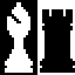

<div>
	
</div>

# pdchess1

pdchess1 : Portable Didactic Chess, incarnation number 1.

A rudimentary chess application with a command-line interface.

[![build status][build-status-badge-image]][build-status-url]
[![latest tag][latest-tag-badge-image]][latest-tag-url]
[![watchers][watchers-badge-image]][watchers-url]
[![stars][stars-badge-image]][stars-url]
[![forks][forks-badge-image]][forks-url]
[![repo dependents][repo-dependents-badge-image]][repo-dependents-url]
[![pkg dependents][pkg-dependents-badge-image]][pkg-dependents-url]
[![commits][commits-badge-image]][commits-url]
[![last commit][last-commit-badge-image]][last-commit-url]
[![license][license-badge-image]][license-url]
[![FOSSA Status][fossa-badge-image]][fossa-badge-url]

<!-- [![install size][install-size-badge-image]][install-size-url] -->

## Building `pdchess1`

`gcc` must be present in order to build the project.

If [make](https://www.gnu.org/software/make/manual/make.html) is present, it can be used to help build the project:

```sh
$ make
$ ./pdchess
```

If `make` is absent, the project can be built using `gcc` alone:

```sh
$ ./build.sh
$ ./pdchess
```

## Playing `pdchess1`

A fairly standard command syntax is used to specify moves; e.g.:

- e2 e4 : An initial pawn move by White
- g8 f6 : An initial knight move by Black
- O-O : Castle on the kingside
- O-O-O : Castle on the queenside

- :? : Help
- :q : Quit

## Example

The beginning of a sample run involving the Sicilian Defence:

```
Game or study? (g/s): g

White: human or computer (h/c): h

Black: human or computer (h/c): c
Max search depth for Black (1-25): 5
Extended max search depth for Black (5-25): 5
Resign threshold (3-100): 10

rnbqkbnr
pppppppp
-+-+-+-+
+-+-+-+-
-+-+-+-+
+-+-+-+-
PPPPPPPP
RNBQKBNR

Move #1
White: e2 e4
Matching move in book...

rnbqkbnr
pppppppp
-+-+-+-+
+-+-+-+-
-+-+P+-+
+-+-+-+-
PPPP-PPP
RNBQKBNR

Move #1
Black: Working...
Using opening book...
Black: c7 c5

rnbqkbnr
pp+ppppp
-+-+-+-+
+-p-+-+-
-+-+P+-+
+-+-+-+-
PPPP-PPP
RNBQKBNR

Move #2
White: ...
```

## History

- I witnessed the University of Waterloo host a tournament of Othello (Reversi)-playing programs in 1992; these programs played each other by sending game data over the Internet.
- After creating my own rudimentary Othello-playing program in C, I chose chess as the next problem domain to tackle. The result was incarnation number 1 of pdchess, which was written in C in 1993. I began the project during my university exams in April. This version had a console interface. I started developing it on the univerity's Unix computers, then e-mailed the source code to my e-mail address at Digital Equipment of Canada in Ottawa, where I worked during the summer of 1993. At Digital, I ported the code to compile and run on the VAX/VMS operating system, and I continued development. In August 1993, I e-mailed the source code back to Waterloo. Just before finishing my final term in April 1994, I copied the source code to a 3.5-inch floppy and took it with me.
- During the summer of 1994, I modified the code to work on my brand-new computer (an Intel 80486SX PC clone running Windows 3.1, with 640 KB + 3072 KB of RAM and a 360 MB hard drive, plus 3.5-inch and 5.25-inch floppy drives) via Borland Turbo C++ 3.1. I created a GUI for pdchess using Turbo C++'s OWL (Object Windows Library) framework. (OWL was analogous to Microsoft's MFC.)
- [Incarnation number 2](https://github.com/tom-weatherhead/pdchess2) of pdchess was written in C++ in 2002, after I had read Bjarne Stroustrup's book on the language.
- [Incarnation number 3](https://github.com/tom-weatherhead/pdchess3) of pdchess was written in Typescript in Beijing, China in February and March 2020, during the COVID-19 coronavirus pandemic.
- pdchess is also known to some as 'partly done chess'. :-)

## License
[MIT](https://choosealicense.com/licenses/mit/)

[build-status-badge-image]: https://secure.travis-ci.org/tom-weatherhead/pdchess1.svg
[build-status-url]: https://travis-ci.org/tom-weatherhead/pdchess1
[latest-tag-badge-image]: https://badgen.net/github/tag/tom-weatherhead/pdchess1
[latest-tag-url]: https://github.com/tom-weatherhead/pdchess1/tags
[watchers-badge-image]: https://badgen.net/github/watchers/tom-weatherhead/pdchess1
[watchers-url]: https://github.com/tom-weatherhead/pdchess1/watchers
[stars-badge-image]: https://badgen.net/github/stars/tom-weatherhead/pdchess1
[stars-url]: https://github.com/tom-weatherhead/pdchess1/stargazers
[forks-badge-image]: https://badgen.net/github/forks/tom-weatherhead/pdchess1
[forks-url]: https://github.com/tom-weatherhead/pdchess1/network/members
[repo-dependents-badge-image]: https://badgen.net/github/dependents-repo/tom-weatherhead/pdchess1
[repo-dependents-url]: https://badgen.net/github/dependents-repo/tom-weatherhead/pdchess1
[pkg-dependents-badge-image]: https://badgen.net/github/dependents-pkg/tom-weatherhead/pdchess1
[pkg-dependents-url]: https://badgen.net/github/dependents-pkg/tom-weatherhead/pdchess1
[commits-badge-image]: https://badgen.net/github/commits/tom-weatherhead/pdchess1
[commits-url]: https://github.com/tom-weatherhead/pdchess1/commits/master
[last-commit-badge-image]: https://badgen.net/github/last-commit/tom-weatherhead/pdchess1
[last-commit-url]: https://badgen.net/github/last-commit/tom-weatherhead/pdchess1
[install-size-badge-image]: https://badgen.net/packagephobia/install/pdchess1
[install-size-url]: https://badgen.net/packagephobia/install/pdchess1
[license-badge-image]: https://img.shields.io/github/license/mashape/apistatus.svg
[license-url]: https://github.com/tom-weatherhead/pdchess1/blob/master/LICENSE
[fossa-badge-image]: https://app.fossa.io/api/projects/git%2Bhttps%3A%2F%2Fgithub.com%2Fmoment%2Fmoment.svg?type=shield
[fossa-badge-url]: https://app.fossa.io/projects/git%2Bhttps%3A%2F%2Fgithub.com%2Fmoment%2Fmoment?ref=badge_shield
